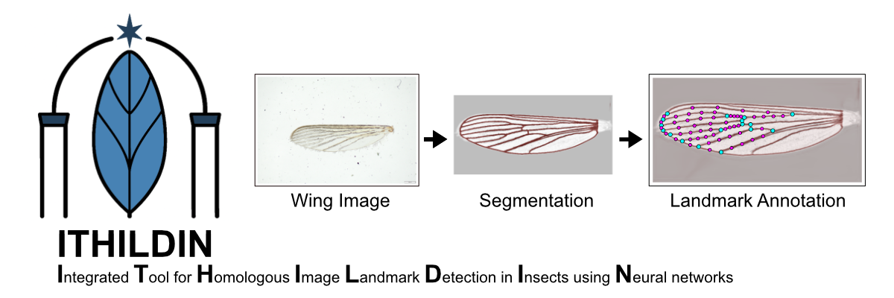

<p align="left">
  
</p>

**Automated wing morphometric analysis and species identification for insects**

ITHILDIN is a deep learning-based pipeline for analyzing insect wing images, with a focus on mosquitoes and related Diptera. The system performs automated segmentation, landmark detection, species classification, and geometric morphometric analysis.

## Abstract
Diptera represent one of the most diverse insect orders, including species with essential ecological functions but also important vectors of human and animal pathogens. Their accurate species identification remains a major bottleneck in ecological and epidemiological studies. Morphological identification requires taxonomic expertise, while molecular methods are costly and not universally reliable. Wing geometric morphometrics offers an alternative, but manual landmark annotation is time-consuming and introduces observer bias. We developed ITHILDIN, a fully automated pipeline for landmark and semilandmark annotation of Diptera wings, combining UNet++ segmentation and an Hourglass landmark prediction model. Using mosquitoes as the primary model system, models were trained on 5,991 annotated images and evaluated on 12,522 images across 34 taxa. We assessed landmark annotation accuracy against human observers and ML-Morph, evaluated species identification performance using Linear Discriminant Analysis on 17 homologous landmarks and 52 semilandmarks, and tested out-of-distribution generalisation by reproducing an independent study. Transferability was demonstrated by adapting the pipeline to Drosophilidae and Glossinidae. The Hourglass model achieved a mean landmark error of 4.5 pixels (95% CI: 4.3–4.6), within human observer variability (4.7 pixels, 95% CI: 4.4–5.0) and substantially outperforming ML-Morph (12.7 pixels, 95% CI: 11.1–14.2). The semilandmark-based approach for species identification achieved 91% balanced accuracy across 34 taxa, approaching CNN performance (94%). On out-of-distribution data, the landmark pipeline generalised substantially better than the CNN and a soft-voting ensemble of the landmark and CNN classifiers achieved 88% balanced accuracy on a replicated study. Combining geometric morphometrics with deep learning provides a reproducible, interpretable, and generalisable alternative to black-box CNN classifiers for Diptera wing analysis. By acting as a consistent single observer, the system eliminates inter-observer bias, enabling large-scale and cross-study morphometric analyses of Dipteran wings. The system is publicly available at ithildin.bnitm.de and transferable to other Diptera families with moderate retraining effort.

<p align="left">
  
</p>


## Features

- **Automated Image Processing**: Background removal, alignment, and normalization
- **Deep Learning Models**:
  - Wing segmentation (U-Net++ with CoordConv)
  - Anatomical landmark detection
  - Species classification (34+ mosquito species)

- **Geometric Morphometrics**:
  - Automated semilandmark placement 
  - Linear Discriminant Analysis (LDA) for species prediction
- **Web Interface**: Flask-based application for batch processing
- **Comprehensive Output**: JSON results, CSV data files, and annotated images

## Installation

### Requirements

- Python 3.8+
- R 4.0+ with geomorph (for geometric morphometrics)
- PyTorch 2.0+
- CUDA (optional, for GPU acceleration)

## Usage

### Docker Deployment (Recommended for Production)

The easiest way to deploy ITHILDIN on a server is using Docker:

```bash
# Build and start the container
docker compose up -d

# Access at http://127.0.0.1:8080
```

See [DOCKER.md](DOCKER.md) for complete Docker deployment guide including production configuration, troubleshooting, and security considerations.

## Project Structure

```
ithildin_wing_analysis/
├── analysis/              # Morphometric analysis and LDA
│   ├── geomorph.py       # R integration for geometric morphometrics
│   └── landmark_analysis.py
├── predictor/            # Neural network models
│   ├── classification.py
│   ├── landmark.py
│   ├── prediction.py
│   └── segmentation.py
├── transform/            # Image and landmark processing
│   ├── image_processing.py
│   ├── landmark_processing.py
│   ├── segmentation_processing.py
│   └── wing_processing.py
├── training/             # Model training scripts and weights
│   ├── data_preparation/ # Python scripts for preparing training data
│   ├── *.ipynb          # Training notebooks
│   └── models/          # Pretrained model weights
├── static/               # Web interface assets
├── templates/            # HTML templates
├── app.py               # Flask web application
├── main.py              # Core pipeline functions
├── utils.py             # Utility functions
├── config.py            # Configuration settings
└── requirements.txt     # Python dependencies
```

### Manual Setup

1. **Clone the repository**:
   ```bash
   git clone https://github.com/KNolte19/ithildin_wing_analysis.git
   cd ithildin_wing_analysis
   ```

2. **Install Python dependencies**:
   ```bash
   pip install -r requirements.txt
   ```

3. **Install R dependencies** (for Procrustes analysis):
   ```R
   install.packages(c("geomorph", "shapes"))
   ```

4. **Download pretrained models**:
   - Place model weights in `training/models/` and `training/models_tsetse/`
   - Update paths in `config.py` if needed

5. **Configure settings**:
   - Edit `config.py` to set your `root_path` and `device` (cpu/cuda/mps)


### Web Interface (Local Development)

Start the Flask application for interactive batch processing:

```bash
python app.py
```

Then open your browser to `http://localhost:5000`


### Command Line

Process images programmatically:

```python
from main import run_prediction
import utils

# Process a single image
run_prediction("path/to/wing_image.jpg", save_path="output/result")

# Batch process and generate DataFrame
prediction_df = utils.json_to_dataframe(
    "output/directory",
    semilandmark=True
)
```

### Configuration

Key settings in `config.py`:

- **Paths**: Model locations and reference data
- **Image Sizes**: Input dimensions for each model
- **Landmarks**: Number and topology of landmarks/semilandmarks
- **Species List**: Classifier output labels
- **Device**: CPU, CUDA, or MPS (Apple Silicon)

## Landmark Reference

The system detects fixed anatomical landmarks on mosquito wings following standard protocols. Semilandmarks are automatically placed along wing veins between fixed landmarks according to the topology defined in `config.py`.

See `config.py` for the complete landmark topology definition.

## Models

### Segmentation
- Architecture: U-Net++ with EfficientNet-B0 encoder
- Input: 640×320 grayscale
- Enhancement: CoordConv layers

### Landmark Detection
- Architecture: Custom Hourglass with CoordConv
- Input: Image + segmentation mask
- Output: Landmark heatmaps

### Classification
- Training data: 34+ mosquito species
- Input: 480×240 contrast-enhanced image
- Output: Species probabilities

## Training Data Preparation

If you want to train your own models, we provide easy-to-use Python scripts for preparing training data.
Refer to the guides in `training/` for step-by-step instructions on how to generate training datasets for segmentation, landmark detection, and classification models.

## Citation

If you use ITHILDIN in your research, please cite:

```
[Citation to be added]
```

## License

CC BY-NC 4.0 License

## Contact

For questions or support, please contact the repository maintainer.

## Acknowledgments

- Uses the `rembg` library for background removal
- Integrates with R's `geomorph` package for morphometric analysis
